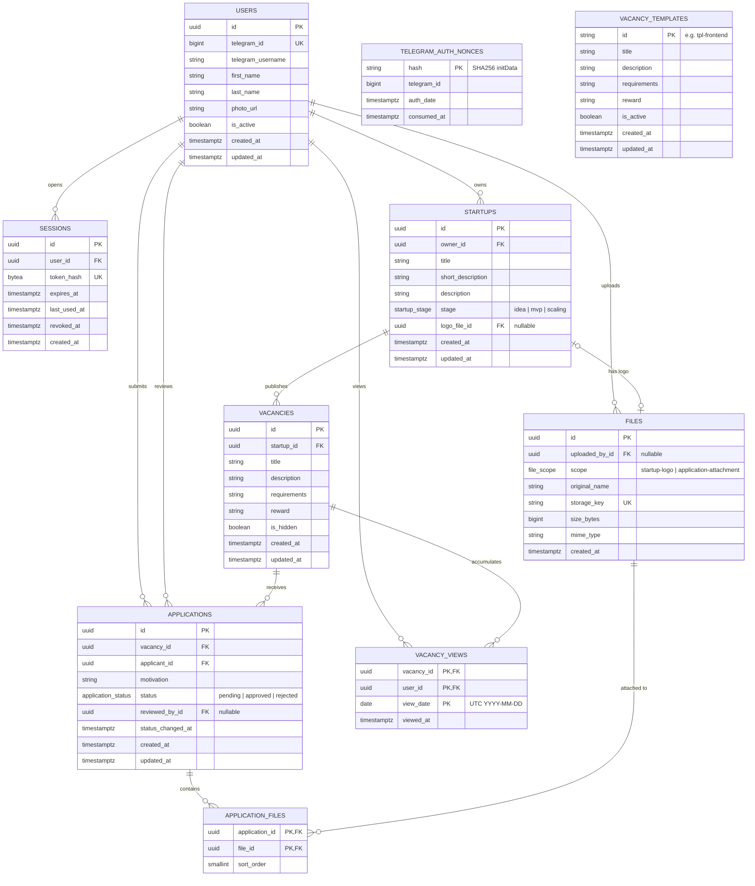

```mermaid
erDiagram
    USERS ||--o{ SESSIONS : "opens"
    USERS ||--o{ STARTUPS : "owns"
    USERS ||--o{ APPLICATIONS : "submits"
    USERS ||--o{ APPLICATIONS : "reviews"
    USERS ||--o{ VACANCY_VIEWS : "views"
    USERS ||--o{ FILES : "uploads"

    STARTUPS ||--o{ VACANCIES : "publishes"
    STARTUPS |o--o| FILES : "has logo"

    VACANCIES ||--o{ APPLICATIONS : "receives"
    VACANCIES ||--o{ VACANCY_VIEWS : "accumulates"

    APPLICATIONS ||--o{ APPLICATION_FILES : "contains"
    FILES ||--o{ APPLICATION_FILES : "attached to"

    USERS {
        uuid id PK
        bigint telegram_id UK
        string telegram_username
        string first_name
        string last_name
        string photo_url
        boolean is_active
        timestamptz created_at
        timestamptz updated_at
    }

    SESSIONS {
        uuid id PK
        uuid user_id FK
        bytea token_hash UK
        timestamptz expires_at
        timestamptz last_used_at
        timestamptz revoked_at
        timestamptz created_at
    }

    TELEGRAM_AUTH_NONCES {
        string hash PK "SHA256 initData"
        bigint telegram_id
        timestamptz auth_date
        timestamptz consumed_at
    }

    STARTUPS {
        uuid id PK
        uuid owner_id FK
        string title
        string short_description
        string description
        startup_stage stage "idea | mvp | scaling"
        uuid logo_file_id FK "nullable"
        timestamptz created_at
        timestamptz updated_at
    }

    VACANCIES {
        uuid id PK
        uuid startup_id FK
        string title
        string description
        string requirements
        string reward
        boolean is_hidden
        timestamptz created_at
        timestamptz updated_at
    }

    VACANCY_TEMPLATES {
        string id PK "e.g. tpl-frontend"
        string title
        string description
        string requirements
        string reward
        boolean is_active
        timestamptz created_at
        timestamptz updated_at
    }

    APPLICATIONS {
        uuid id PK
        uuid vacancy_id FK
        uuid applicant_id FK
        string motivation
        application_status status "pending | approved | rejected"
        uuid reviewed_by_id FK "nullable"
        timestamptz status_changed_at
        timestamptz created_at
        timestamptz updated_at
    }

    FILES {
        uuid id PK
        uuid uploaded_by_id FK "nullable"
        file_scope scope "startup-logo | application-attachment"
        string original_name
        string storage_key UK
        bigint size_bytes
        string mime_type
        timestamptz created_at
    }

    APPLICATION_FILES {
        uuid application_id PK, FK
        uuid file_id PK, FK
        smallint sort_order
    }

    VACANCY_VIEWS {
        uuid vacancy_id PK, FK
        uuid user_id PK, FK
        date view_date PK "UTC YYYY-MM-DD"
        timestamptz viewed_at
    }
```